# Burpsuite Pro Installation Guide (Cracked)

At first download the burpsuite pro jar file

**Download Link:** [https://portswigger.net/burp/documentation/desktop/getting-started/download-and-install](https://portswigger.net/burp/documentation/desktop/getting-started/download-and-install)

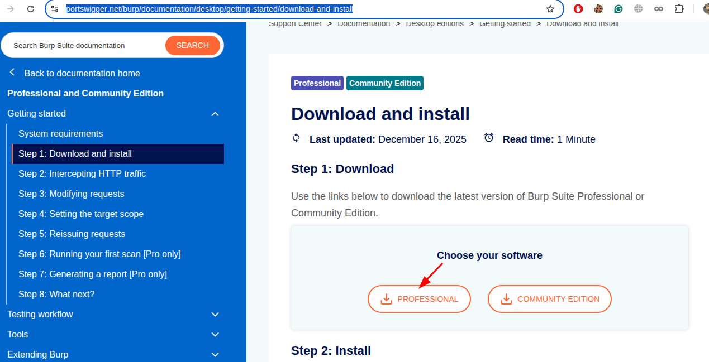


**Download the jar file**

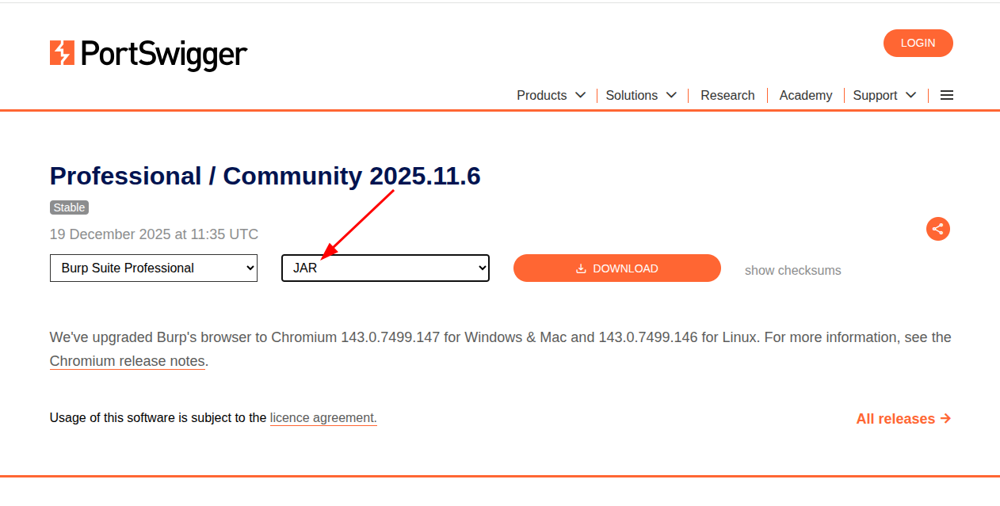

Move downloaded files to /opt/burpsuitepro

```
# Let's create folder
sudo mkdir /opt/burpsuitepro

# Go to your files location

cd /locationofpng,loader,jar

# Move all files (loader, png, burpsuite jar) to /opt/burpsuitepro/

mv * /opt/butpsuitepro
```


```

# Create Necessary folders and file

mkdir -p ~/.local/share/applications
nano ~/.local/share/applications/burpsuitepro.desktop

# Paste this in .desktop file

[Desktop Entry]
Name=Burp Suite Professional
Comment=Web security testing platform
Exec=java -jar /opt/burpsuitepro/loader.jar
Icon=/opt/burpsuitepro/burp_suite.ico
Terminal=false
Type=Application
Categories=Development;Security;WebDevelopment;
StartupWMClass=burpsuite

# Give executable permission and create a soft link to launch with terminal

chmod +x ~/.local/share/applications/burpsuitepro.desktop
update-desktop-database ~/.local/share/applications/
sudo ln -s /opt/burpsuitepro/loader.jar /usr/local/bin/burpsuitepro

# Type this command to launch the burpsuite pro, Not now because we didn't cracked the burpsuite pro yet

burpsuitepro


# Go to the location

cd /opt/burpsuitepro/

# Run the loader

java -jar loader.jar
```

**Change it to your name**

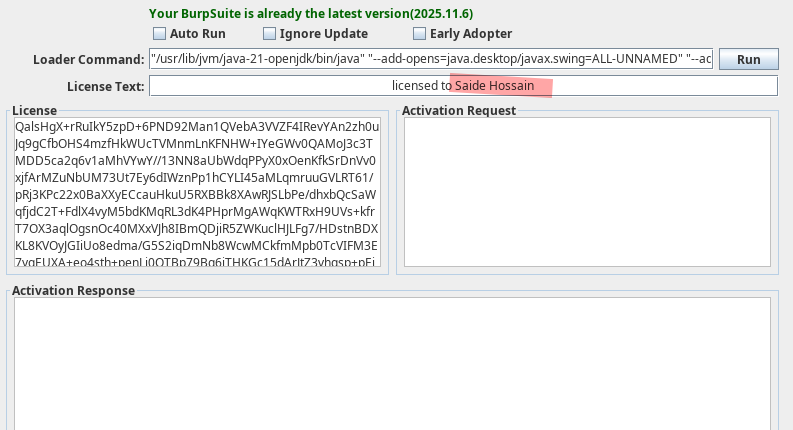

Copy this licence texts

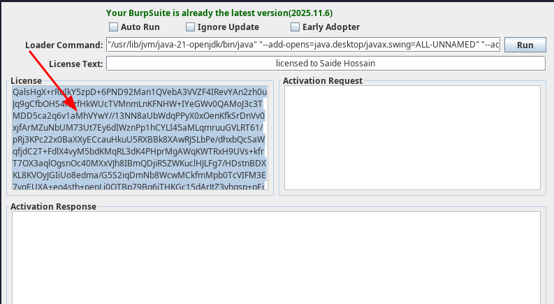

Now click the run

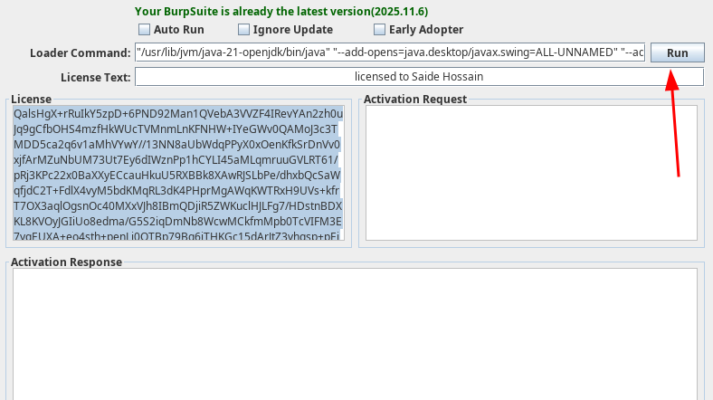

Paste here and next

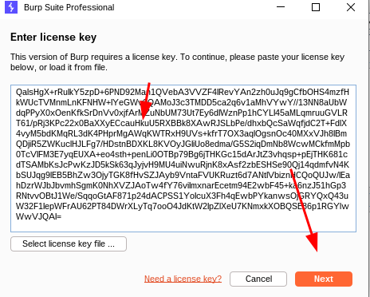

Click Manual Activation

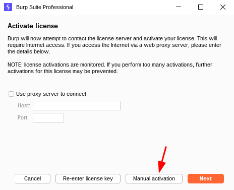

Copy request code

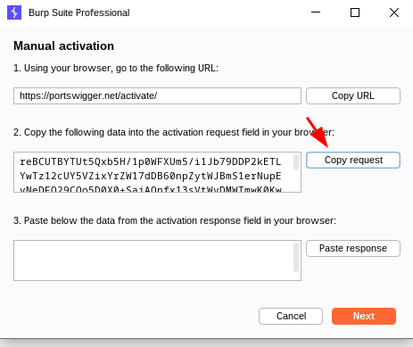

Paste here and copy the response

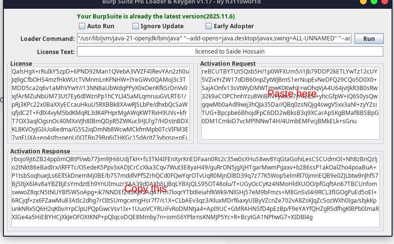

Paste here

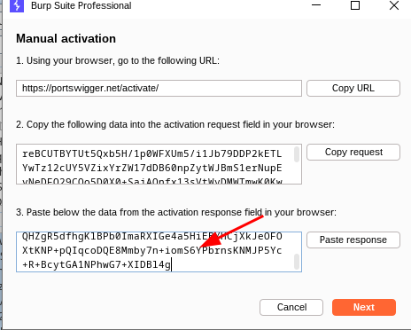

**Congrates! You did it**

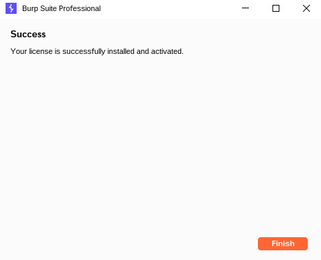

Now copy this command from the loader

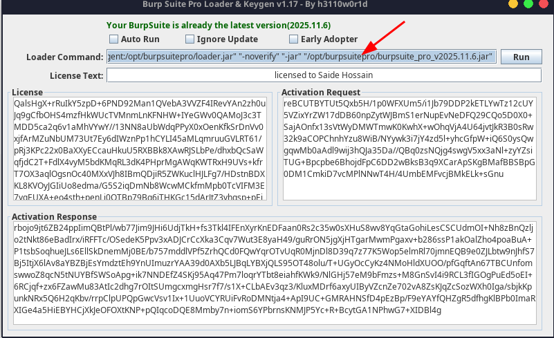

Edit launcher and replace the launching command

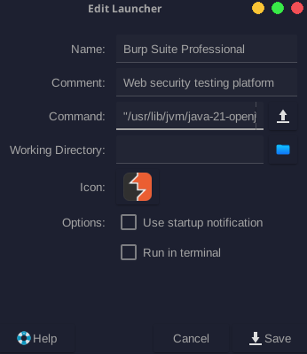

For Debian Edit this

```
[Desktop Entry]
Name=Burp Suite Professional
Comment=Web security testing platform
Exec=java -jar /opt/burpsuitepro/loader.jar
Icon=/opt/burpsuitepro/burp_suite.ico
Terminal=false
Type=Application
Categories=Development;Security;WebDevelopment;
StartupWMClass=burpsuite
```

Change this executable command

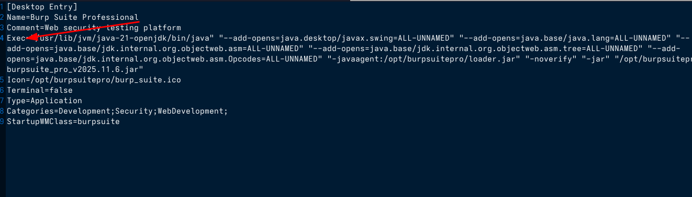

Now all jobs done


